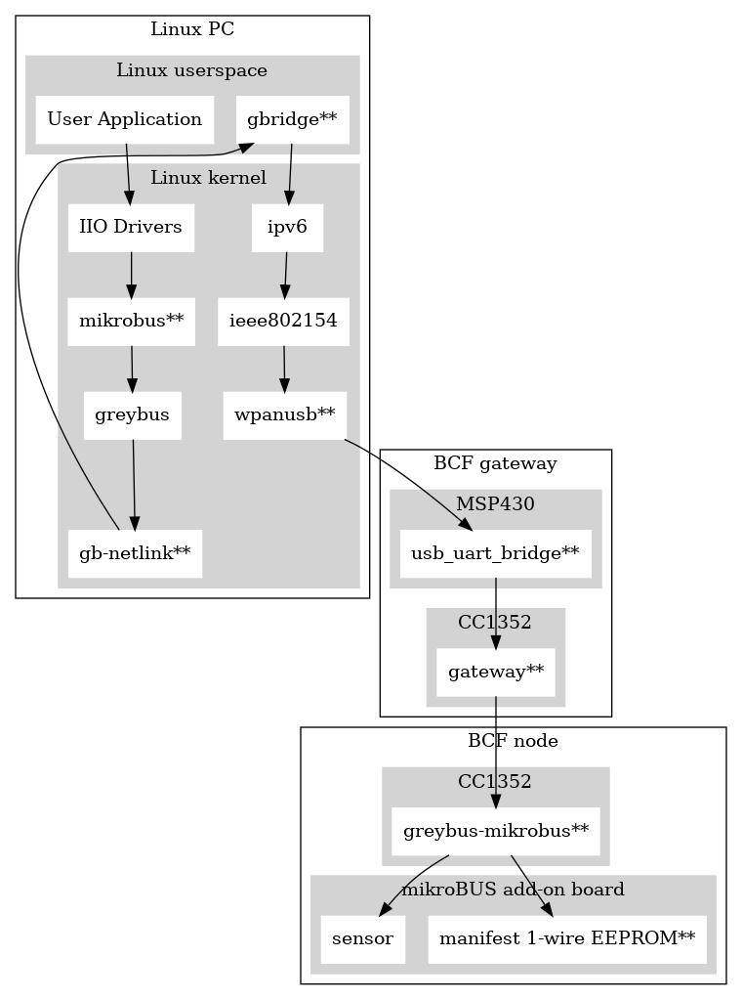

# BeagleConnect Documentation

This is a work-in-progress for some placeholder documentation
that is likely to get moved around to different places as it
solidifies. The [top-level README)[../README.asciidoc] is the
main getting started documentation for now and I'll migrate
some of this over as I can work it out.

Some other place-holders here:

* [MSP430](MSP430.md)
* [Green Gateway](Green_Gateway.md)
* [Roadmap](ROADMAP.md)

# Overall software architecture

\*\* - New code generated in this project

## User Application

We have a lot more layers to add here, but the basic entry into developing
with BeagleConnect Freedom is to create a User Application that will interact
with sensors and actuators over the Linux IIO subsystem, primarily.

TODO: Provide IIO layers to WebThings, Jupyter Notebooks (Python and Julia) and more.

## IIO Drivers

There are hundreds of drivers included in the Linux kernel for interacting
with sensors. This is one of the fundamental code bases upon which this project
is building. It provides an abstract interface such that the sensor data is
self-describing. You can query for lists of sensors and what they measure.

TODO: Think about how we want to augment this interface with network, location
and other metadata to help leverage the sensor data intelligently.

## gbridge\*\*

This application utilizes the gb-netlink driver to extend Greybus to any
transport, including IPv6.

TODO: This is the least stable part of the code stack and needs significant
error handling updates and to provide additional metadata to users.

## gb-netlink\*\*

This kernel driver provides a netlink interface as an alternative transport
for Greybus, rather than the initial Unipro interface it supports in mobile
phones.

TODO: This should be ready to go into the upstream Linux kernel.

## mikrobus\*\*

This 
