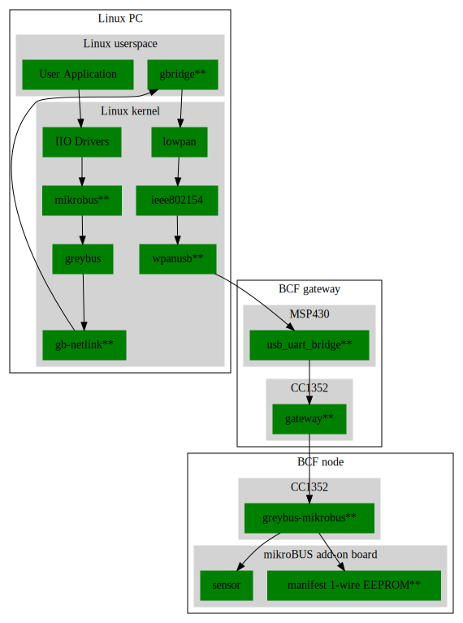

# BeagleConnect Documentation

This is a work-in-progress for some placeholder documentation
that is likely to get moved around to different places as it
solidifies. The [top-level README](../README.asciidoc) is the
main getting started documentation for now and I'll migrate
some of this over as I can work it out.

Some other place-holders here:

* [LEDs](LED.md)
* [MSP430](MSP430.md)
* [Green Gateway](Green_Gateway.md)
* [Roadmap](ROADMAP.md)

# Overall software architecture

\*\* - New code generated in this project

## User Application

We have a lot more layers to add here, but the basic entry into developing
with BeagleConnect Freedom is to create a User Application that will interact
with sensors and actuators over the Linux IIO subsystem, primarily.

TODO: Provide IIO layers to WebThings, Jupyter Notebooks (Python and Julia) and more.

## IIO Drivers

There are hundreds of drivers included in the Linux kernel for interacting
with sensors. This is one of the fundamental code bases upon which this project
is building. It provides an abstract interface such that the sensor data is
self-describing. You can query for lists of sensors and what they measure.

TODO: Think about how we want to augment this interface with network, location
and other metadata to help leverage the sensor data intelligently.

Further reading: 
* [ADI IIO docs](https://wiki.analog.com/software/linux/docs/iio/iio)
* [Linux kernel IIO docs](https://www.kernel.org/doc/html/latest/driver-api/iio/intro.html)

## mikrobus\*\*

This kernel driver provides a pin-exact abstraction for sensor boards and
an identification mechanism that can be used to load the appropriate IIO Drivers
for a given sensor board.

This driver can be used with or without Greybus to make usage of mikroBUS add-on
boards not require the addition of device tree overlays or kernel modifications.

TODO: This driver needs to be resubmitted upstream and the manifest format should
be aligned.

RISK: The manifest format might not be sufficiently defined and approved upstream.

Further reading:
* [LPC 2020 presentation](https://linuxplumbersconf.org/event/7/contributions/669/)
* [mikroBUS driver wiki](https://elinux.org/Mikrobus)

## greybus

This kernel driver enables the embedded busses used to connect sensors, like SPI,
I2C, UART, ADC and GPIO, to be dynamically added to a system and for transactions
on them to be performed on an RPC-like mechanism.

Further reading:
* [GKH Intro to Greybus](https://kernel-recipes.org/en/2015/talks/an-introduction-to-greybus/)
* [RPC on Wikipedia](https://en.wikipedia.org/wiki/Remote_procedure_call)

## gb-netlink\*\*

This kernel driver provides a netlink interface as an alternative transport
for Greybus, rather than the initial UniPro interface it supports in mobile
phones.

TODO: This should be ready to go into the upstream Linux kernel.

## gbridge\*\*

This application utilizes the gb-netlink driver to extend Greybus to any
transport, including IPv6.

TODO: This is the least stable part of the code stack and needs significant
error handling updates and to provide additional metadata to users.

Futher reading:
* [Greybus for IoT at ELC on Youtube](https://www.youtube.com/watch?v=7H50pv-4YXw&list=PLbzoR-pLrL6pRFP6SOywVJWdEHlmQE51q) [slides](https://elinux.org/images/c/cb/Using_Greybus_for_IoT.pdf)

## lowpan/ieee802154

These drivers provide the upper networking layers for talking to the BeagleConnect Freedom
Sub-GHz network.

Further reading:
* [6LoWPAN on Wikipedia](https://en.wikipedia.org/wiki/6LoWPAN)

## wpanusb\*\*

This kernel driver is used by a number of IEEE802.15.4 MAC compatbible devices to provide
an interface to low-power, long-range wireless networks over USB.

TODO: This should be ready to go into the upstream Linux kernel.

Futher reading:
* [wpanusb driver on Github](https://github.com/finikorg/wpanusb)
* [Zephyr sample](https://docs.zephyrproject.org/2.6.0/samples/net/wpanusb/README.html)

## usb\_uart\_bridge\*\*

This MSP430 firmware acts as both a USB-to-UART bridge to access the Zephyr console on the
CC1352 as well as capturing WPANUSB USB actions and sending those to the CC1352 over HDLC.

Further reading:
* [BCF MSP430 doc](MSP430.md)
* [Source code](https://github.com/jadonk/msp430F55xx_usb_uart_bridge)
* [HDLC on Wikipedia](https://en.wikipedia.org/wiki/High-Level_Data_Link_Control)

## gateway\*\*

This CC1352 Zephyr-based firmware acts as an IEEE802.15.4 radio accepting HDLC encoded
transactions over the CC1352 UART.

TODO: This needs to be integrated into a single firmware image.

TODO: The UART pin-flip issue must be addressed along with dynamic UART selection for
the console and the HDLC-based radio interface.

Further reading:
* [wpanusb\_bc source code on Github](https://github.com/jadonk/wpanusb_bc)

## greybus-mikrobus\*\*

This CC1352 Zephyr-based firmware takes Greybus transactions provided via IPv6 packets
over a IEEE802.15.4 radio and converts them into mikroBUS provided hardware interface
busses, including I2C, SPI, UART and GPIO.

TODO: Loading new manifests into non-volatile storage needs to be made easier from
the command-line until the manifest 1-wire EEPROMs become commonplace.

TODO: The UART pin-flip issue must be addressed.

Further reading:
* [greybus-for-zephyr source code on Github](https://github.com/jadonk/greybus-for-zephyr)

## Summary

Futher reading:
* [LPC2020 presentation: Using Linux, Zephyr & Greybus for IoT](https://linuxplumbersconf.org/event/7/contributions/814/)
