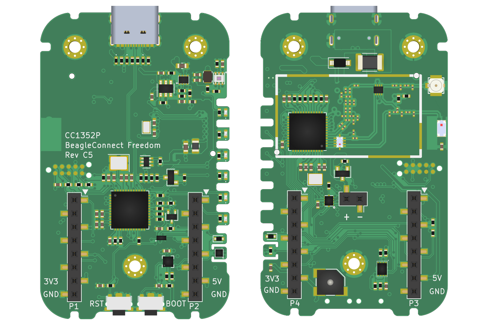

== BeagleConnect™ Introduction

BeagleConnect™ is a revolutionary technology virtually eliminating low-level software
development for https://en.wikipedia.org/wiki/Internet_of_things[IoT] and https://en.wikipedia.org/wiki/Industrial_internet_of_things[IIoT] applications, such as building automation, factory
automation, home automation, and scientific data acquisition. While numerous IoT and IIoT
solutions available today
provide massive software libraries for microcontrollers footnote:[Complexity can be seen by exploring https://www.arduino.cc/reference/en/libraries/category/sensors/[Arduino sensor libraries]]
supporting a limited body of
https://en.wikipedia.org/wiki/Sensor[sensors],
https://en.wikipedia.org/wiki/Actuator[actuators] and
https://en.wikipedia.org/wiki/Indicator_(distance_amplifying_instrument)[indicators]
as well as libraries for communicating over various networks,
BeagleConnect simply eliminates the need for these libraries by shifting the burden
into the most massive and collaborative software project of all time, the https://en.wikipedia.org/wiki/Linux_kernel[Linux kernel].

These are the tools used to automate things in
https://en.wikipedia.org/wiki/Data_collection_system[scientific data collection],
https://en.wikipedia.org/wiki/Data_science[data science],
https://en.wikipedia.org/wiki/Mechatronics[mechatronics], and
https://en.wikipedia.org/wiki/Internet_of_things[IoT].

BeagleConnect™ technology solves: 

* The need to write software to add a large set of diverse devices to your system, 
* The need to maintain the software with security updates, 
* The need to rapidly prototype using off-the-shelf software and hardware without wiring, 
* The need to connect to devices using long-range, low-power wireless, and 
* The need to produce high-volume custom hardware cost-optimized for your requirements.

=== BeagleConnect™ experience
BeagleConnect™ provides a scalable experience for interacting with the physical world.

NOTE: The term _BeagleConnect™_ refers to a technology comprising of
a family of boards, a collection of Linux kernel drivers,
microcontroller firmware, a communication protocol, and system-level
integration to automation software tools. More specific terms will be
applied in the architecture details. The term is also used here to
represent the experience introduced to users through the initial
_BeagleConnect™ Freedom_ product consisting of a board and case which
ships programmed and ready to be used.

For scientists, we are integrating https://jupyter.org/[Jupyter Notebook] with the data streams
from any of hundreds of sensor options, including https://www.mikroe.com/click/sensors/force[vibration],
https://www.mikroe.com/click/sensors/gas[gas detection],
https://www.mikroe.com/click/sensors/biometrics[biometrics] and
https://www.mikroe.com/click/sensors[more]. These data streams can be stored in simple
https://en.wikipedia.org/wiki/Comma-separated_values[data files] or processed and visualized.

#TODO: provide images demonstrating Jupyter Notebook visualization

For embedded systems developers, data is easily extrated using the standard
https://www.kernel.org/doc/html/latest/driver-api/iio/index.html[IIO]
interface provided by the https://kernel.org[Linux kernel]
running on the gateway using any of hundreds of
programming languages and environments, without writing a line of microcontroller firmware.
The Linux environment provides opportunities for high-level remote management using tools
like https://balena.io[Balena] with applications deployed in
https://docker.io[Docker] containers.

#TODO: provide image illustrating remote management

The hardware and software are fully open source, providing for scalability and a lack of
vendor lock-in.

For DevOps...

For home automaters, integration into https://webthings.io[WebThings]...

#TODO: think a bit more about this section with some feedback from Cathy.

=== BeagleConnect™ hardware

==== BeagleConnect™ Freedom

image::images/BeagleConnect-Freedom-C5-HandPhoto.png[]

IMPORTANT: _BeagleConnect™ Freedom_ enables wirelessly adding new device nodes and is targeted
to cost initially around US$20 with a roadmap to variants as low as US$1.

The initial _BeagleConnect™ Freedom_ production release will: 

* Support at least 100 https://elinux.org/Mikrobus[mikroBUS]-based https://mikroe.com/click[Click boards from Mikroelectronika], 
* Work with https://en.wikipedia.org/wiki/Bluetooth_Low_Energy[Bluetooth Low Energy (BLE)]-enabled Linux computers at 2.4GHz, 
* Work with long-range sub-1GHz https://en.wikipedia.org/wiki/IEEE_802.15.4[IEEE 802.15.4 wireless connections] at 500 meters with data rates of 1kbps, and 
* Work with a low-cost BeagleBoard.org Linux https://en.wikipedia.org/wiki/Single-board_computer[single-board computer (SBC)] as a `BeagleConnect™ gateway device` and
  work with at least 10 other `BeagleConnect™ node devices` each supporting 2 add-on sensor, actuator or indicator devices.

Future releases will be collaborated with the community, evolve
dynamically, and contain additional functionality. The goal is to
support over 500 add-on devices within the first year after the
initial release.

[[beta-kit]]
==== BeagleConnect™ Freedom beta kit

A small number of beta kits have been assembled with BeagleConnect™ Freedom rev C5
boards, which is the version that should be taken to production.

The kit includes:

* 1x https://wiki.seeedstudio.com/BeagleBone-Green-Gateway/[Seeed BeagleBone® Green Gateway] (board, USB cable)
* 3x BeagleConnect™ Freedom (board, attenna, USB cable)
* 1x https://www.mikroe.com/unique-id-click[MikroElektronikia Click ID Board]

To get started with this kit, see <<demo-1>>.

=== BeagleConnect™ Mobile Gateway

This is a work-in-progress that will be released as the first integrated BeagleConnect™
gateway. It is possible to assemble a gateway with any Linux computer, but this computer
will ship setup and ready to go.

The gateway is built from:

* BeagleBoard.org PocketBeagle,
* BeagleConnect™ Freedom,
* a cellular modem,
* a USB WiFi dongle,
* antennas, and
* an enclosure.

[[architecture]]
==== Architecture

[[beagleconnect-leash]]
==== BeagleConnect™ Freedom
_BeagleConnect™ Freedom_ is based on the https://www.ti.com/product/CC1352R[TI CC1352] and is the first available
BeagleConnect™ solution. It implements:

* `BeagleConnect™ gateway device` function for Sub-GHz 802.15.4 long-range wireless
* `BeagleConnect™ node device` function for Bluetooth Low-Energe (BLE) and Sub-GHz
802.15.4 long range wireless
* USB-based serial console and firmware updates
* 2x https://www.mikroe.com/mikrobus[mikroBUS sockets] with `BeagleConnect™ protocol support`

#TODO: provide image of BeagleConnect™ Freedom in a case with a hand for size perspective

[[what-is-new]]
==== What makes BeagleConnect™ new and different?

IMPORTANT: BeagleConnect™ solves IoT in a different and better way than any previous
solution.

[[the-device-interface-software-is-already-done]]
==== The device interface software is already done

BeagleConnect™ uses the collaboratively developed Linux kernel to contain
the intelligence required to speak to these devices (sensors, actuators,
and indicators), rather than relying on writing code on a
microcontroller specific to these devices. Some existing solutions rely
on large libraries of microcontroller code, but the integration of
communications, maintenance of the library with a limited set of
developer resources and other constraints to be explained later make
those other solutions less suitable for rapid prototyping than
BeagleConnect™.

Linux presents these devices abstractly in ways that are
self-descriptive. Add an accelerometer to the system and you are
automatically fed a stream of force values in standard units. Add a
temperature sensor and you get it back in standard units again. Same for
sensing magnetism, proximity, color, light, frequency, orientation, or
multitudes of other inputs. Indicators, such as LEDs and displays, are
similarly abstracted with a few other kernel subsystems and more
advanced actuators with and without feedback control are in the process
of being developed and standardized. In places where proper Linux kernel
drivers exist, no new specialized code needs to be created for the
devices.

IMPORTANT: _Bottom line_: For hundreds of devices, users won't have to write a
single line of code to add them their systems. The automation code they
do write can be extremely simple, done with graphical tools or in any
language they want. Maintenance of the code is centralized in a small
reusable set of microcontroller firmware and the Linux kernel, which is
highly peer reviewed under a
https://wiki.p2pfoundation.net/Linux_-_Governance[highly-regarded
governance model].

[[on-going-maintenance]]
==== On-going maintenance

Because there isn't code specific to any given network-of-devices
configuration, we can all leverage the same software code base. This
means that when someone fixes an issue in either BeagleConnect™ firmware
or the Linux kernel, you benefit from the fixes. The source for
BeagleConnect™ firmware is also submitted to the
https://www.zephyrproject.org/[Zephyr Project] upstream, further
increasing the user base. Additionally, we will maintain stable branches
of the software and provide mechanisms for updating firmware on
BeagleConnect™ hardware. With a single, relatively small firmware load,
the potential for bugs is kept low. With large user base, the potential
for discovering and resolving bugs is high.

[[rapid-prototyping-without-wiring]]
==== Rapid prototyping without wiring

BeagleConnect™ utilizes the https://elinux.org/Mikrobus[mikroBUS
standard]. The mikroBUS standard interface is flexible enough for almost
any typical sensor or indicator with hundreds of devices available.

NOTE: Currently, we have support in the Linux kernel for a bit over 100
_Click_ mikroBUS add-on boards from Mikroelektronika and are working
with Mikroelektronika on a updated version of the specification for these
boards to self-identify. Further, eventually the vast majority of over
800 currently available _Click_ mikroBUS add-on boards will be supported
as well as the hundreds of compliant boards developed every year.

[[long-range-low-power-wireless]]
==== Long-range, low-power wireless

_BeagleConnect™ Freedom_ wireless hardware is built around a
http://www.ti.com/product/CC1352R[TI CC1352] multiprotocol and multi-band Sub-1 GHz and 2.4-GHz wireless 
microcontroller (MCU). CC1352R includes a 48-MHz Arm® Cortex®-M4F processor, 352KB Flash, 256KB ROM, 8KB Cache SRAM,
80KB of ultra-low leakage SRAM, and https://en.wikipedia.org/wiki/Over-the-air_programming[Over-the-Air] upgrades (OTA).

[[full-customization-possible]]
==== Full customization possible

BeagleConnect™ utilizes https://www.oshwa.org/definition/[open source
hardware] and https://en.wikipedia.org/wiki/Open-source_software[open
source software], making it possible to optimize hardware and software
implementations and sourcing to meet end-product requirements.
BeagleConnect™ is meant to enable rapid-prototyping and not to
necessarily satisfy any particular end-product's requirements, but with
full considerations for go-to-market needs.

Each BeagleBoard.org BeagleConnect™ solution will be:

* Readily available for over 10 years, 
* Built with fully
open source software with submissions to mainline Linux and Zephyr
repositories to aide in support and porting, 
* Built with fully open
source and non-restrictive hardware design including schematic,
bill-of-materials, layout, and manufacturing files (with only the
BeagleBoard.org logo removed due to licensing restrictions of our
brand), 
* Built with parts where at least a compatible part is available
from worldwide distributors in any quantity, 
* Built with design and
manufacturing partners able to help scale derivative designs, 
* Based on
a security model using public/private keypairs that can be replaced to
secure your own network, and 
* Fully FCC/CE certified.
